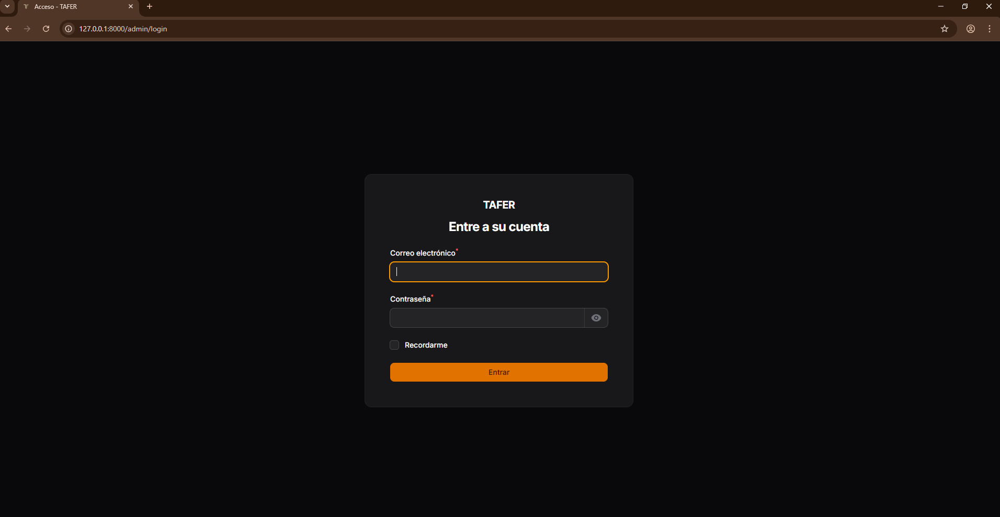
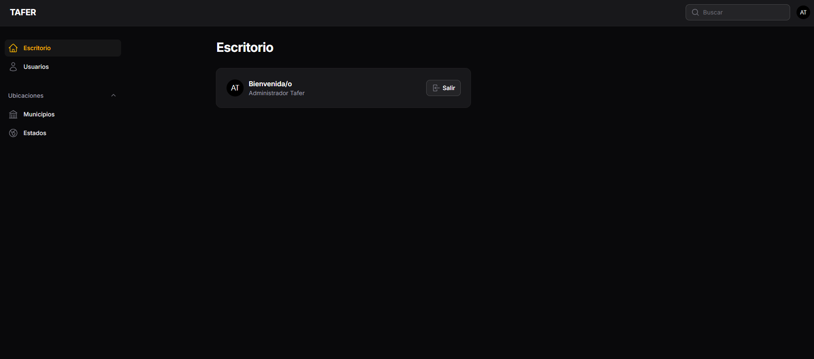
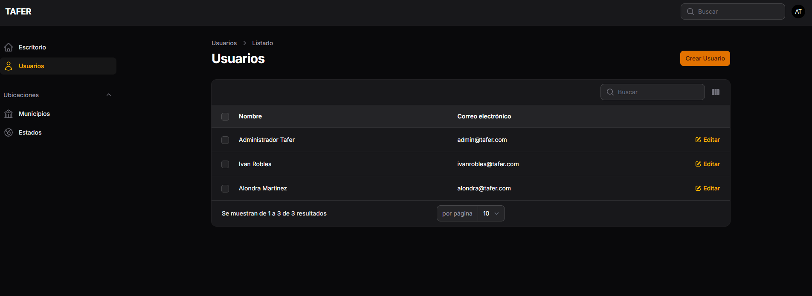
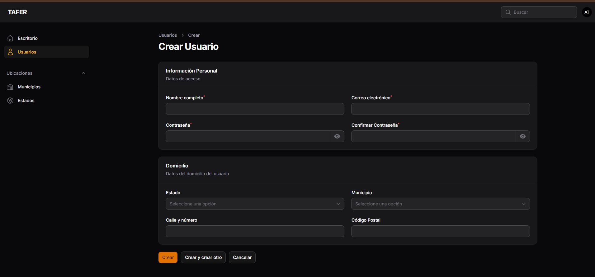

## Sistema de Gestión de Usuarios

Aplicación web desarrollada con Laravel 10 y Filament, que permite la administración de usuarios mediante un panel administrativo moderno, seguro y completamente funcional.


## Tecnologías Utilizadas

* **Lenguaje:** PHP 8.4
* **Framework:** Laravel 13.0
* **Panel Administrativo:** Filament PHP v5.5
* **Base de Datos:** SQLite 
* **Gestor de dependencias:** Composer
* **Manejo de base de datos:** Eloquent ORM 

## Extensiones de PHP requeridas

Es recomendable tener habilitadas las siguientes extensiones en PHP para el correcto funcionamiento del sistema:

* **zip**
* **fileinfo**
* **intl**
* **pdo_sqlite**
* **sqlite3**

Activación de extensiones en PHP
Para habilitar estas extensiones, edita el archivo php.ini y asegúrate de que las siguientes líneas estén activas (sin ; al inicio):

* **extension=zip**
* **extension=fileinfo**
* **extension=intl**
* **extension=pdo_sqlite**
* **extension=sqlite3**


##  Instrucciones de Instalación
1️⃣ Clonar el Repositorio
Obtén una copia local del proyecto y accede al directorio raíz:
```
git clone https://github.com/IvanRobles19/user-management-system-tafer.git
```


2️⃣ Instalar dependencias
> [!IMPORTANTE]
> Después de clonar, asegúrate de entrar a la carpeta del proyecto antes de ejecutar cualquier otro comando:
> `cd user-management-system-tafer`

Instala las librerías de PHP
```
composer install
```

3️⃣ Configuración del Entorno
Prepara el archivo de configuración y la base de datos:

***Configurar variables de entorno***

**Windows (PowerShell) / Linux / Mac:**
```
cp .env.example .env
```
**Windows (CMD):**
```
copy .env.example .env
```

Generar la clave de encriptación de la aplicación
```
php artisan key:generate
```
<br>
<br>

***Configuración de Base de Datos (SQLite)***

El sistema utiliza SQLite para garantizar una revisión rápida y sin configuraciones de servidores externos

**Windows (PowerShell):**
```
touch database/database.sqlite
```
**Linux / Mac / Git Bash:**
```
touch database/database.sqlite
```
**Windows (CMD):**
```
type nul > database/database.sqlite
```


4️⃣ Migraciones y Datos de Prueba
Ejecuta la estructura de tablas y carga los catálogos de Estados, Municipios y el usuario administrador inicial:

```
php artisan migrate --seed
```

5️⃣ Puesta en Marcha
Inicia el servidor de desarrollo de Laravel:
```
php artisan serve
```

##   Acceso al Sistema
Una vez iniciado el servidor, puedes acceder a la interfaz administrativa a través de la siguiente URL:

URL: http://127.0.0.1:8000/


##  Credenciales de Acceso (Admin)
El DatabaseSeeder genera automáticamente el siguiente usuario:
* **URL:** /admin
* **Correo Electrónico:** admin@tafer.com
* **Contraseña:** Tafer2026*


##  Capturas de Pantalla
Login


Escritorio (Dashboard)
Panel principal con widgets de estadísticas y acceso rápido.


Gestión de Usuarios
Tabla optimizada con etiquetas en español y columnas accionables. 


Formulario de Registro
Esquema de domicilio con lógica de selección dependiente para Estados y Municipios.


## Estructura de la base de datos

Tabla: users

| Campo           | Tipo      | Descripción               | Obligatorio |
| --------------- | --------- | ------------------------- | ----------- |
| id              | bigint    | ID único                  | Sí          |
| name            | string    | Nombre del usuario        | Sí          |
| email           | string    | Correo único              | Sí          |
| password        | string    | Contraseña encriptada     | Sí          |
| address         | string    | Dirección del usuario     | No          |
| postal_code     | string    | Código Postal del usuario | No          |
| state_id        | bigint    | Relación con el estado    | No          |
| municipality_id | bigint    | Relación con el municipio | No          |
| created_at      | timestamp | Fecha de creación         | Sí          |
| updated_at      | timestamp | Fecha de actualización    | Sí          |

**Nota:**
Los campos relacionados con el domicilio (`address`, `postal_code`, `state_id`, `municipality_id`) son **opcionales** y pueden ser nulos, ya que no son obligatorios para el registro del usuario.


### Tabla: states

| Campo | Tipo   | Descripción       |
| ----- | ------ | ----------------- |
| id    | bigint | ID                |
| name  | string | Nombre del estado |


### Tabla: municipalities

| Campo    | Tipo   | Descripción            |
| -------- | ------ | ---------------------- |
| id       | bigint | ID                     |
| name     | string | Nombre del municipio   |
| state_id | bigint | Relación con el estado |

Cada municipio pertenece a un estado mediante una relación foránea (`state_id`).
